# 🛡️ Enzo Demaretz — CTI/DFIR Analyst & Security Engineer

CTI/DFIR Analyst & Security Engineer on a purple team, with expertise in threat hunting, DFIR, web pentesting and user security awareness training, built up notably as an independent consultant. Passionate about networking, system architecture, security tool development and malware analysis.

📍 Independent purple team cybersecurity consultant **currently on hold** (my current full-time role takes up all my time) — the tools below were developed in that context and keep evolving in my personal time.

---

## 🎖️ Certifications

<table>
<tr>
<td align="center">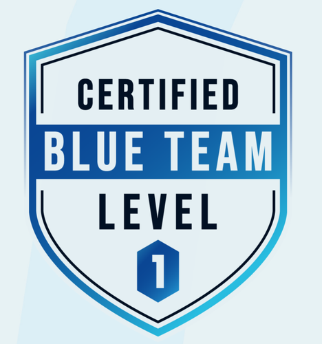 <b>Blue Team Level 1</b> Security Blue Team</td>
<td align="center">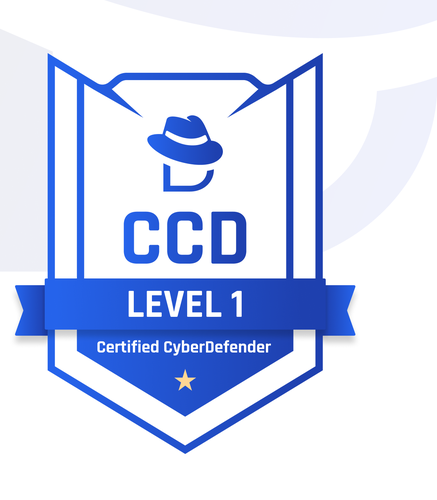 <b>Certified CyberDefender L1</b> CyberDefenders</td>
<td align="center">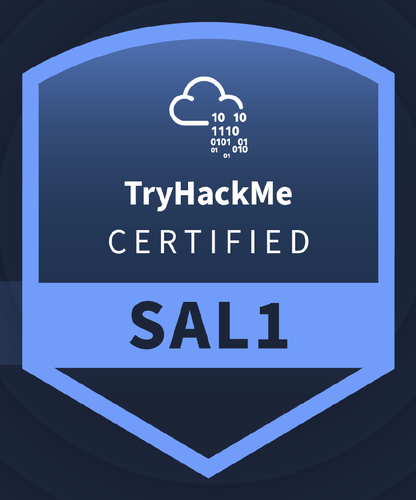 <b>Security Analyst (SAL1)</b> TryHackMe</td>
<td align="center">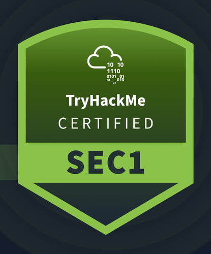 <b>Cyber Security 101 (SEC1)</b> TryHackMe</td>
</tr>
<tr>
<td align="center">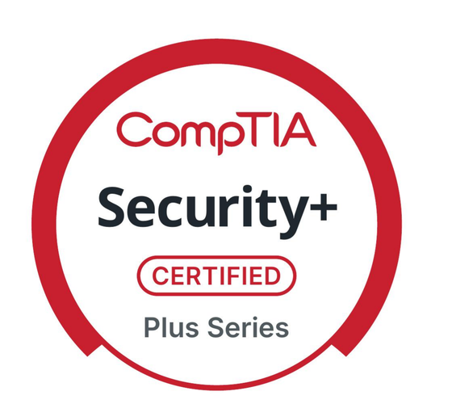 <b>Security+</b> CompTIA</td>
<td align="center">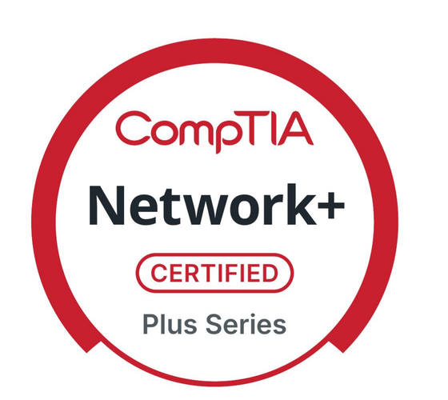 <b>Network+</b> CompTIA</td>
<td align="center">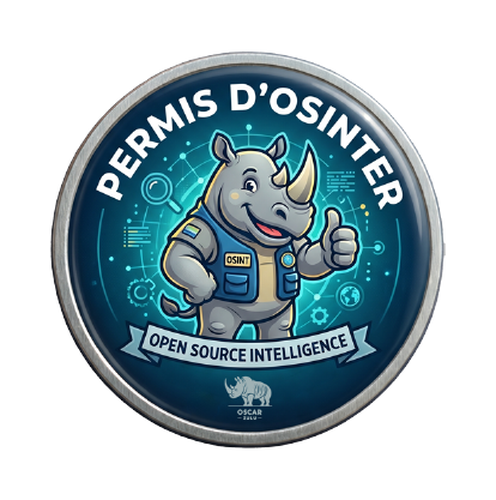 <b>Permis d'Osinter</b> Oscar Zulu Crew</td>
<td align="center">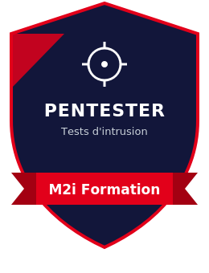 <b>Pentester</b> M2i Formation</td>
</tr>
<tr>
<td align="center">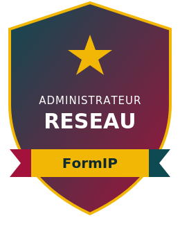 <b>Network Administrator</b> FormIP</td>
<td align="center"> <b>Tosa DigComp</b> Isograd — Expert</td>
<td align="center">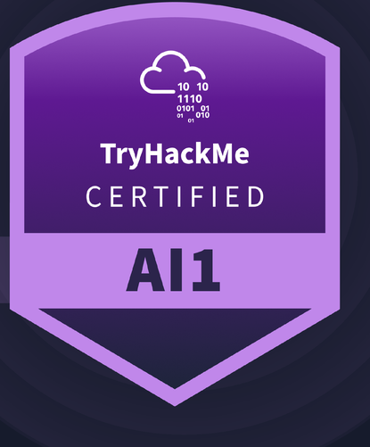 <b>AI Security (AI1)</b> TryHackMe</td>
</tr>
</table>

---

## 📌 Summary

- [🔵 Blue Team & DFIR](#-blue-team--dfir)
- [🎓 SOC & DFIR Training Simulators](#-soc--dfir-training-simulators)
- [🔴 Red Team & Offensive Security](#-red-team--offensive-security)
- [🛠️ Open-Source Tools](#️-open-source-tools)
- [📚 Other Projects](#-other-projects)
- [📫 Contact](#-contact)

---

## 🔵 Blue Team & DFIR

### [Warden](https://github.com/Spellskite-coding/Warden)
Standalone EDR for Linux workstations, written in Rust — **no server, no cloud dependency, no agent-to-collector traffic**: a single hardened local systemd service, with an optional graphical interface.

- Four independent detection modules, each with its own monitoring loop: **ransomware** (fanotify, high-entropy write bursts tracked per process/directory/globally, per-machine randomized honeypots), **persistence** (inotify on cron, sudoers.d, systemd units, XDG autostart, profile.d, rc files — with heuristics on reverse shells and curl-pipe-shell), **privilege escalation** (unexpected setuid/setgid binaries) and **malicious signatures** (live YARA scanning via fanotify and on-demand)
- Optional **eBPF** module (tracepoints on process execution and network connections) for visibility into fileless execution, beyond what file monitoring alone allows
- Enforce-mode response: process termination via **pidfd** (immune to PID-reuse races, with fallback to a classic `kill`), quarantine of affected files
- Hardened through several rounds of **real-world red-team testing** against the active detection modules (fanotify TOCTOU window bypasses, package-manager spoofing, burst-detector evasion...), each confirmed lead reproduced in real conditions and then fixed
- Installer/uninstaller validated end-to-end (real install → real detection → real uninstall) on apt (Debian, Ubuntu), dnf, pacman and zypper

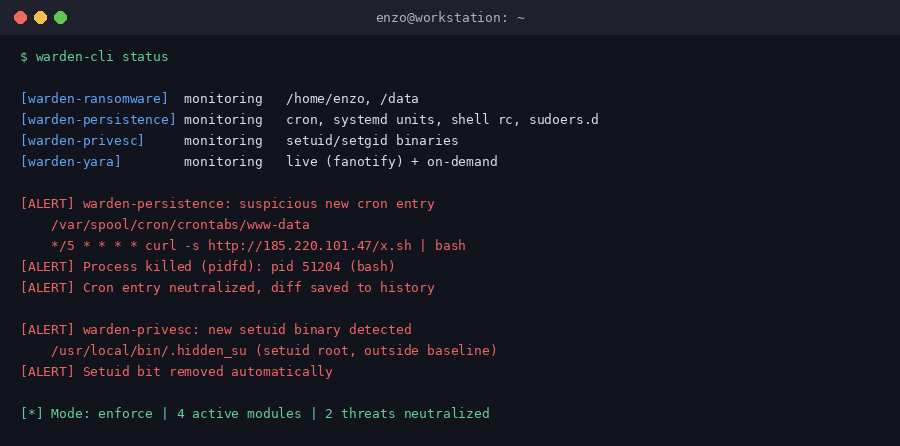

---

### [RansomShield](https://github.com/Spellskite-coding/RansomShield)
**Behavior-based** ransomware detection daemon, written in Rust, for Linux servers — built on `fanotify(7)` (mainline kernel API, no kernel module, no eBPF, no `unsafe` code in the daemon).

- Doesn't react to file modification per se, but to the **specific encryption pattern**: a burst of high-entropy writes across many distinct files within a short time window, or the triggering of a **honeypot** file that no legitimate process should ever touch
- **Per-directory baseline**: a high-entropy write only counts if the directory previously held plaintext content — avoids false positives on backup/export folders that legitimately receive archives
- **Trusted executable whitelist** (path + SHA-256), usable for fine-grained exemption of a known backup/encryption script — never applies to honeypot detection
- **Enforce-mode response**: immediate SIGSTOP of the process, quarantine of affected files, SIGKILL, then incident report and external notification hook (email/Slack/PagerDuty)
- **Tested exclusively in disposable Docker containers**, never on a host or with real ransomware samples — attack simulators and legitimate workloads (backup, trusted encryption) across 5 distributions
- Also hardened through a **dedicated red team audit** and an in-depth **SAST review** of the codebase, on top of the container-based functional testing
- Test results: on a burst of 300 files, only 8 (2.7%) touched before the process was stopped, all recovered intact in quarantine, response time under one second

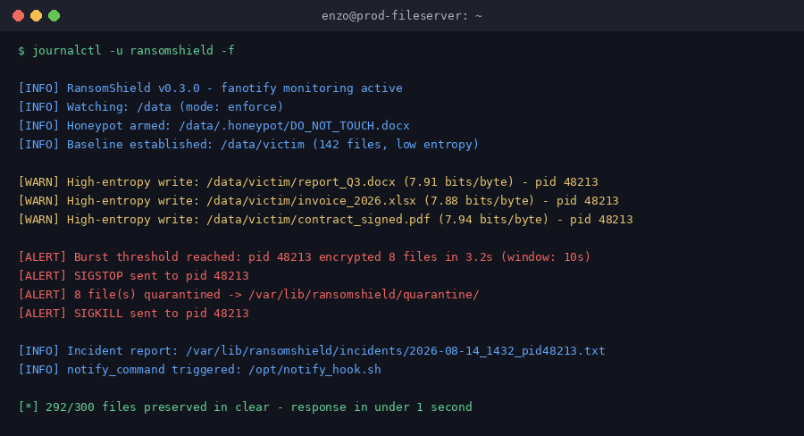

---

### [win_malware_analyzer](https://github.com/Spellskite-coding/win_malware_analyzer)
In-depth static analysis of Windows binaries (EXE/DLL/SYS): IOC extraction, behavioral capability mapping and automated reverse engineering kickoff.

- Structural PE parsing via **LIEF**: sections, entropy, security mitigations (ASLR, DEP/NX, CFG), imports
- Mapping of potential malicious capabilities (process injection, anti-debug, persistence, keylogging, ransomware, C2) from imported APIs
- IOC extraction (IPs, domains, URLs, Windows registry paths/keys, commands), including from base64-encoded content
- Reverse engineering kickoff via **r2pipe** (Rizin): entry-point decompilation, cross-references of sensitive APIs
- Full report export in JSON format

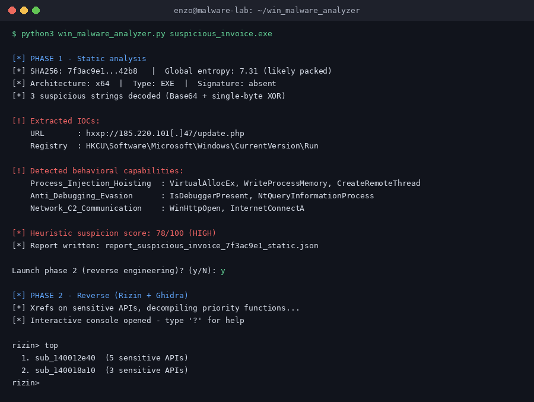

---

### [LinuxHunt](https://github.com/Spellskite-coding/LinuxHunt)
Linux equivalent of **DeepBlueCLI** (SANS): parsing and threat hunting on Linux system logs (`auth.log`, `syslog`, `audit.log`, `journalctl`) to surface malicious and suspicious behavior during incident response.

- Detection: SSH bruteforce, persistence (SSH keys, cron, UID 0 accounts), privilege escalation, abnormal `sudo` usage
- Output directly actionable in the terminal, designed for fast-paced investigation
- Used in real conditions on Debian systems

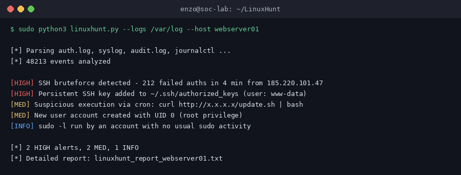

---

### [static_doc_analyzer](https://github.com/Spellskite-coding/static_doc_analyzer)
Static document analyzer (PDF, OOXML — docx/xlsx...) to decide whether a received file can be safely opened, **without ever executing it**.

- Zero external dependency (no third-party library, no called binary): fully standalone tool
- Designed as an extra layer of protection on Linux, in the absence of antivirus
- Accuracy first: strong detection with a minimum of false positives

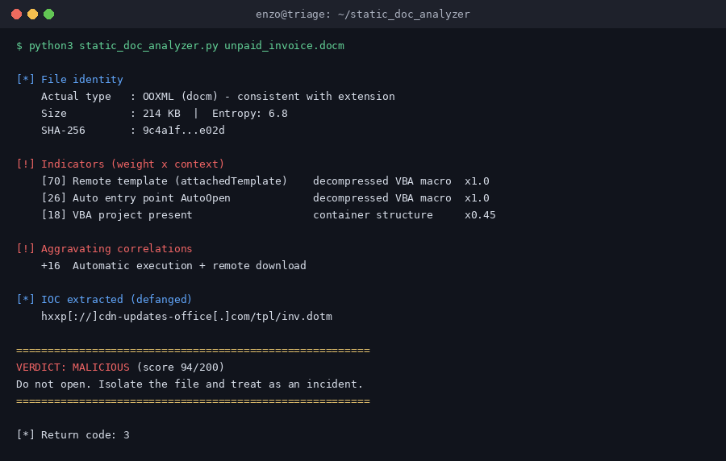

---

### [linux_forensics](https://github.com/Spellskite-coding/linux_forensics) — *DFIR Linux Sniper*
Linux **live forensics** script for incident response: zero external dependency, fully in-memory execution, no alteration of the analyzed machine's state.

- Detects binaries communicating with a C2, memory-resident processes with abnormal behavior (e.g. `memfd_create`, binary deleted from disk), rootkits and hidden files in `/tmp`, `/var/tmp`, `/dev/shm`
- Behavior adapted based on user or root execution, with explicit confirmation before enabling full mode
- Reports the SHA256 of every suspicious file detected, for immediate CTI on hashes

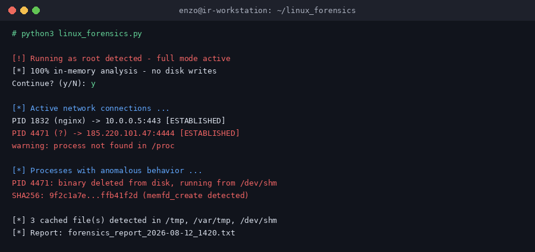

---

## 🎓 SOC & DFIR Training Simulators

Static, dependency-free web apps built to train analysts under realistic conditions — no server, no network calls, deployable in one click via GitHub Pages. Designed as a companion pair: one drills decision-making under pressure, the other drills methodical reconstruction.

### [Open-SOC](https://github.com/Spellskite-coding/Open-SOC)
SOC shift simulator: an alert every two to three minutes, eleven initial-access scenarios plus six short-form alerts, played in a fictional SIEM/EDR with no escalation path — the analyst is the one who responds.

- Timed triage and cross-alert correlation, with realistic background noise and no case ID handed over
- Decide and remediate: isolate, disable, reset, revoke MFA — or escalate to the client when that's the correct call, and know when to leave a legitimate case untouched
- Closure requires a verdict, a severity, an ATT&CK technique (140 techniques across 14 tactics) and a cited written report
- Detailed scoring across five axes, with a full debrief and exportable JSON report

**[▶ Live demo](https://spellskite-coding.github.io/Open-SOC/)**

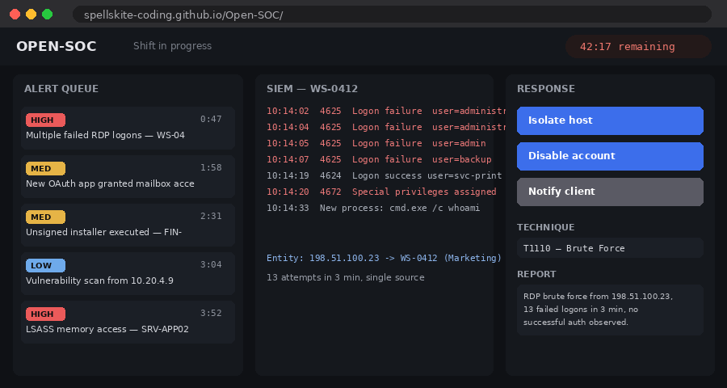

### [Open-Forensics](https://github.com/Spellskite-coding/Open-Forensics)
Digital forensics simulator: ten incident cases, nothing but logs, fifteen thousand lines to sift through — establish the facts, reconstruct the attack, and prove it in a written report.

- Cross-exhibit search and per-exhibit filtering across pure log evidence, no disk image or memory capture
- Findings validated against leniently-normalized answers (case, accents, defanged indicators, French/ISO timestamps)
- Full ATT&CK attack chain across twelve tactics, including correctly declaring tactics that were *not* observed
- Deterministic background traffic (fixed per case/exhibit) so instructors can prepare an answer key and students can compare notes

**[▶ Live demo](https://spellskite-coding.github.io/Open-Forensics/)**

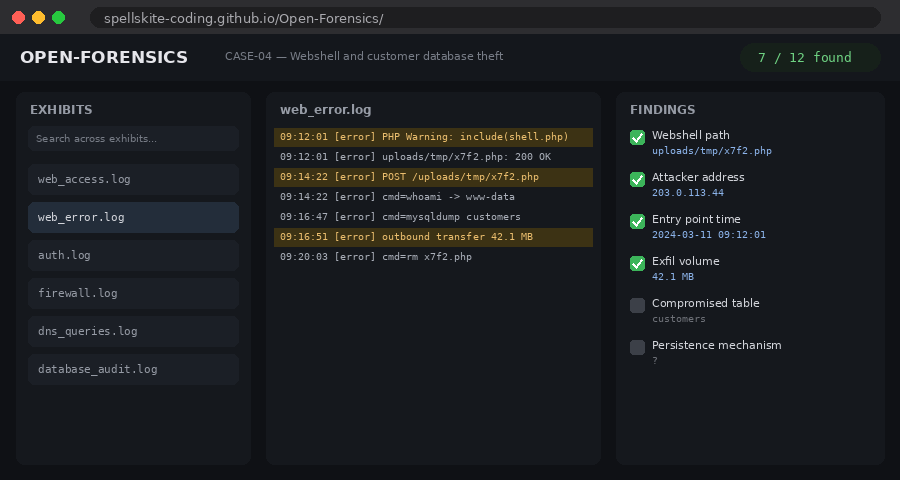

---

## 🔴 Red Team & Offensive Security

### SQLi_XSS_tester
Automation script for enumerating **SQL Injection** and **XSS** vulnerabilities on a web target during a pentest: tests URL parameters and forms automatically detected on the page (via BeautifulSoup), with payloads covering classic injection, blind/time-based techniques and several filter-bypass methods.

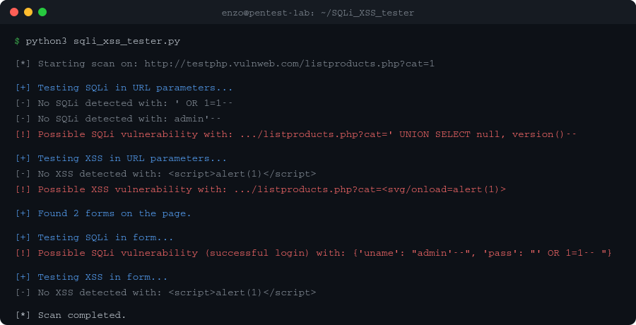

### LFI_tester
Script dedicated to enumerating **Local File Inclusion** vulnerabilities: classic traversal, encoding bypasses (single/double, UTF-8), PHP wrappers (`php://filter`, `php://input`, `expect://`), and log-poisoning detection on common Apache/Nginx log files.

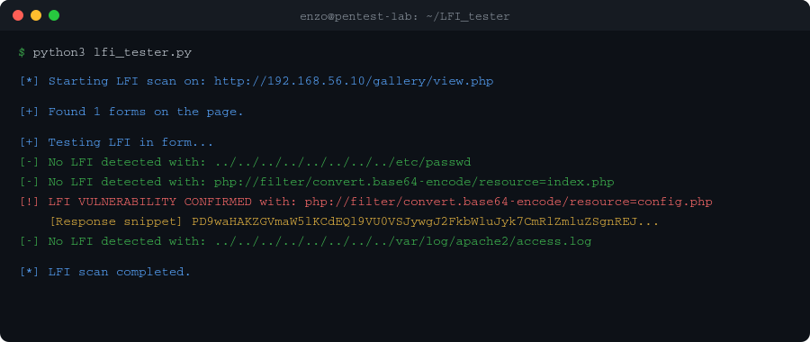

### Binary Fuzzer
Fuzzer generating cyclic patterns to identify crashes (buffer overflow) in a target binary, with automatic calculation of the crash offset from the returned address.

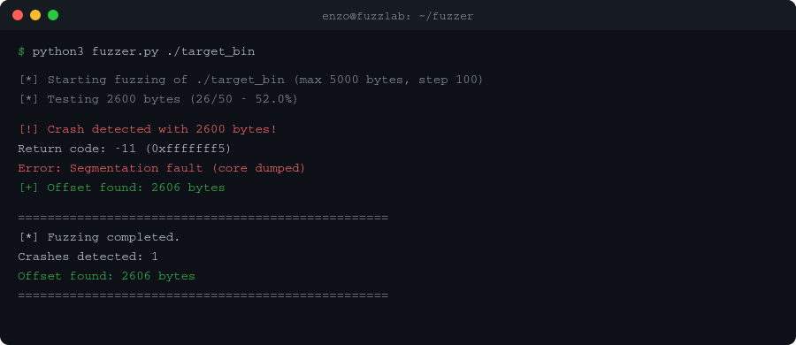

### Secrets Finder
Secrets scanner for files and directories: detection of AWS keys, GitHub/Slack tokens, private keys, passwords and suspicious base64 strings via a regex ruleset, with JSON report export — useful during code review as part of an audit or pentest.

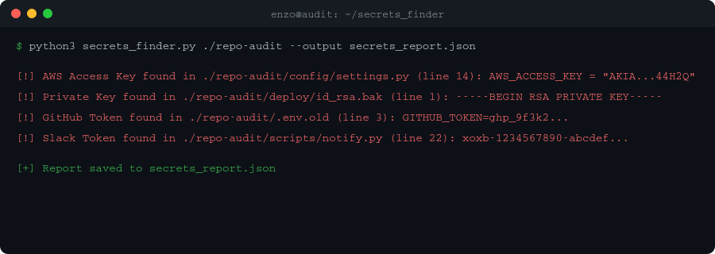

---

## 🛠️ Open-Source Tools

Public-facing tools, built to be simple, safe and privacy-respecting — no telemetry, no hidden dependency.

### [La Meuh 🐄](https://github.com/Spellskite-coding/La_meuh)
Automates updating all Windows programs in one click via `winget upgrade --all`. A single executable, no external dependency.

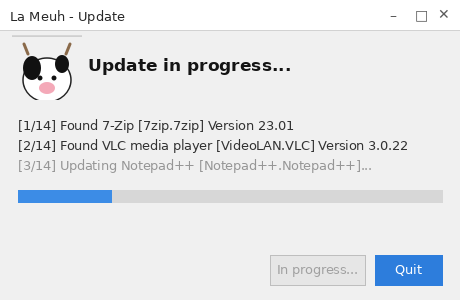

### [Hus-Clean](https://github.com/Spellskite-coding/hus-clean)
Cleaner for temporary files and unwanted cookies (Chrome, Firefox, Brave, Edge, Opera, Vivaldi) — the lightweight alternative to a CCleaner-like tool, requiring no administrator rights and with explicit confirmation before any deletion.

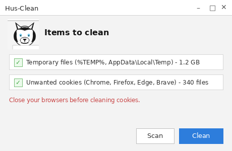

### [Colibri Converter](https://github.com/Spellskite-coding/Colibri_Converter)
Cross-platform PDF ↔ DOCX conversion, 100% local: no network access required, in the same spirit as La Meuh and Hus-Clean — security and simplicity first.

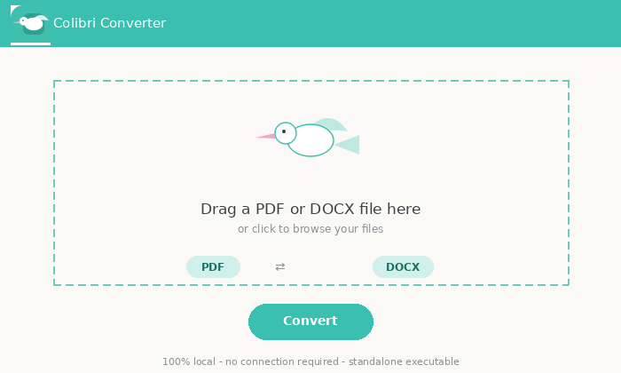

---

## 📚 Other Projects

### [Security System Administrator](https://github.com/Spellskite-coding/Security_System_Administrator)
Security homelab integrating several interconnected SOC, detection and IT management building blocks:

- **SOC on Wazuh**: alert centralization and correlation
- **Wazuh ↔ GLPI integration**: critical alerts automatically trigger ticket creation in GLPI via the API
- **On-the-fly malware detection**: a **Samba** share hosts the SOC, GLPI and shared files; as soon as a file is dropped there, Wazuh raises a drop alert, **ClamAV** scans the file, and the result is reported back into Wazuh
- **FreeBSD host**: runs the **Suricata** IDS and hosts a dedicated jail exposing the **Cowrie** honeypot
- **Enterprise Cisco networks**: designed and secured in Packet Tracer

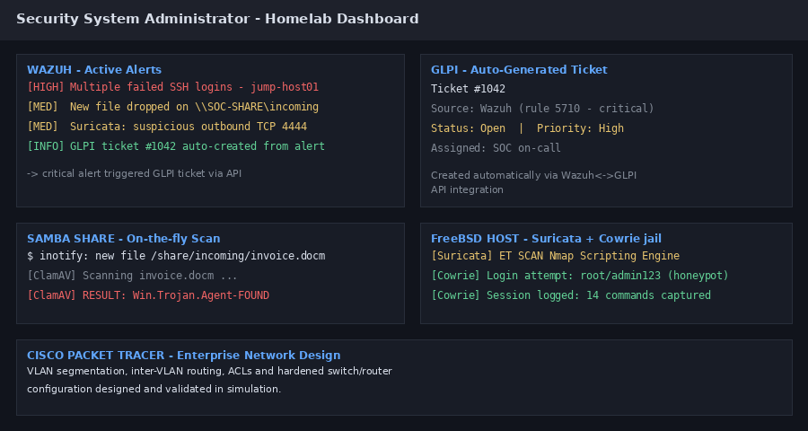

-grey?style=flat-square)

### [Binary Analysis](https://github.com/Spellskite-coding/Binary_Analysis)
Malicious binary analysis reports, covering:

- **CTI**: IOC extraction and correlation
- **Static analysis** of malware
- **Reverse engineering**

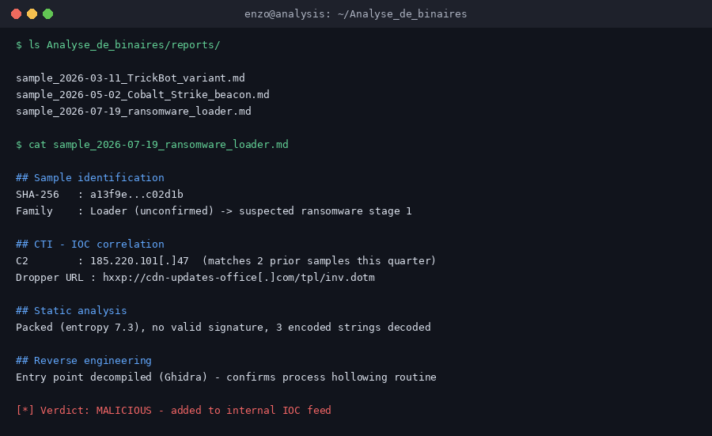

### [Cybersecurity Guide](https://github.com/Spellskite-coding/Cybersecurity_Field_Guide)
Guide of tools and commands for the cybersecurity community.

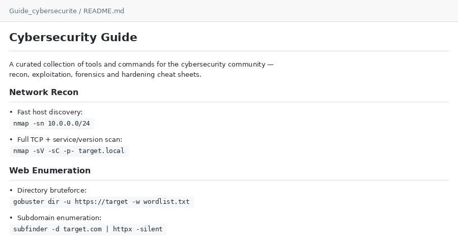

---

## 📫 Contact

